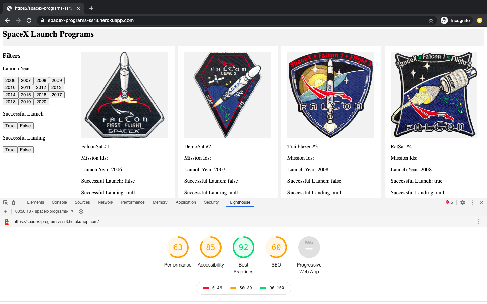
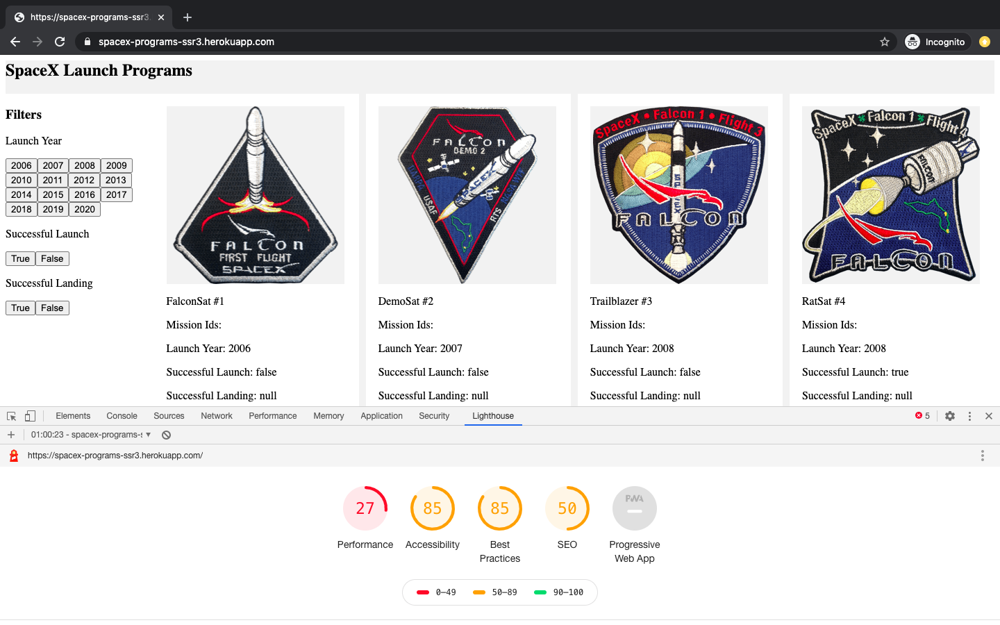

A Front-End application to help users list and browse launches by SpaceX program.

## Available Scripts

In the project directory, you can run:

### `npm run dev`

Runs the app in the development mode. 
Open [http://localhost:3000](http://localhost:3000) to view it in the browser.
The page will reload if you make edits. 

### `npm start`

Builds the app for production to:  
`build` folder - Server. 
`public` folder - Client. 
It correctly bundles React in production mode and optimizes the build.

## Live Website:
Hoisted in Heroku: https://spacex-programs-ssr3.herokuapp.com/ 
Automatic deployment from GitHub 'main' branch is setup.

## Stack Used:
Rendering Server: Node, Express 
Front End: React 
State Management: Redux 
Other Important Libraries: React Router 

The application is built from scratch and is not using any Server Rendering Framework/Library

## API Used:
https://api.spacexdata.com/v3  
No Authentication is required to access the API

## Technical Functionality:
- The initial launch programs landing page has been server side rendered.
- The UX and the launches data is prefetched before the first time page load.
- No Framework/Library is used for Server Side Rendering. Built from Scratch.
- The Subsequent Filters are implemented in Client Side. When the user selects different filters, a API GET call is triggered to get the data.
- The Grid structure is implemented using CSS Grids / Flexbox.

## TODO:
- Responsive Design
- UX Changes
- Server Side Render when the page is refreshed with the applied filters in the URL
- Improve SEO, Optimize Performance for production build
- Unit Tests

## Current Lighthouse Screenshots

### Desktop:

 
 

### Mobile:

